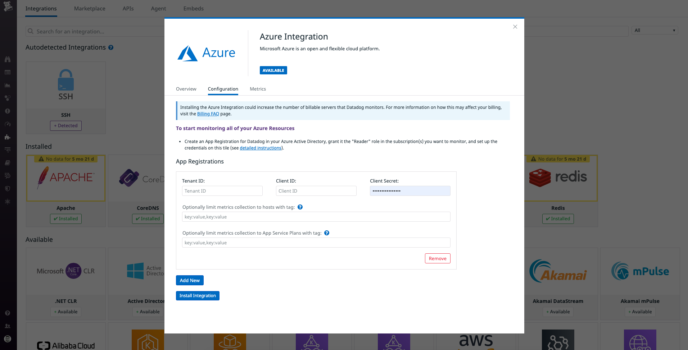
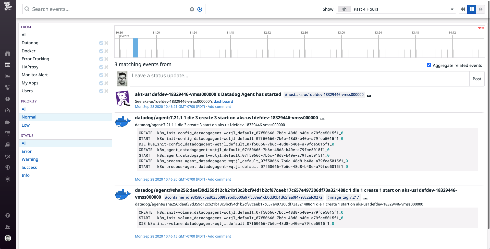
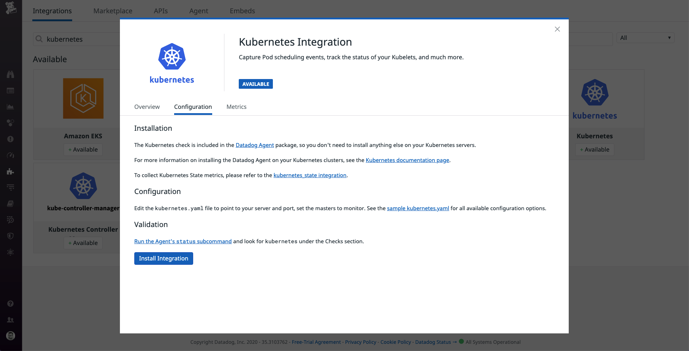
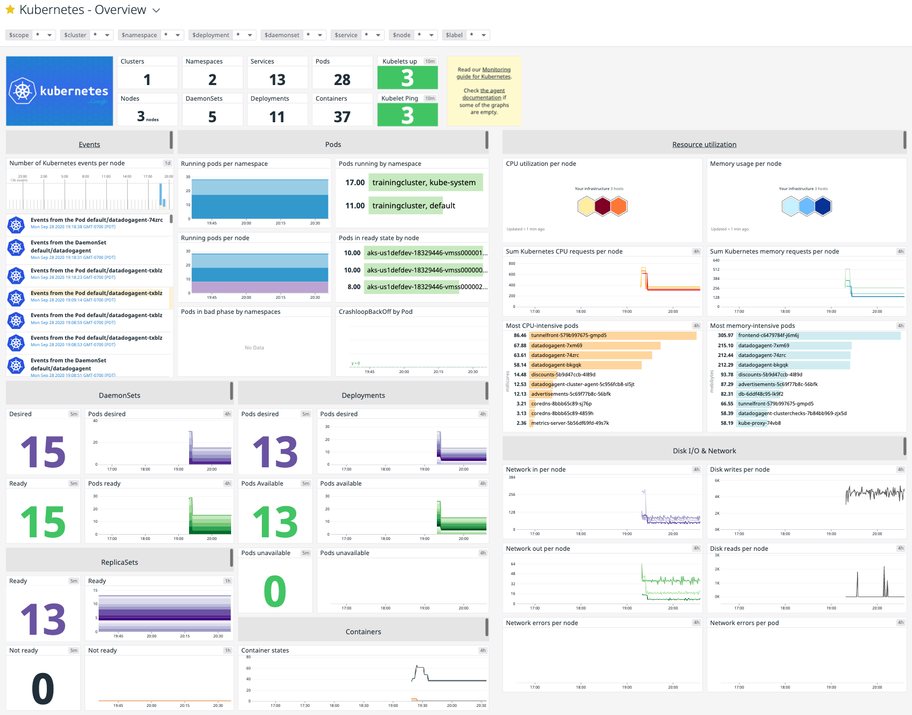
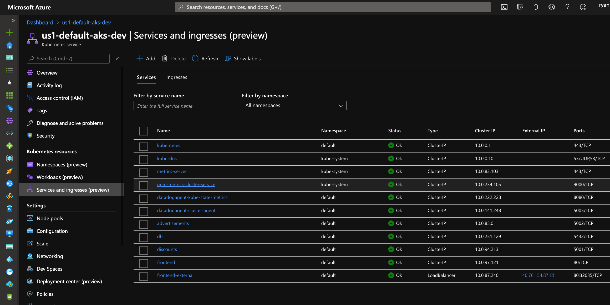
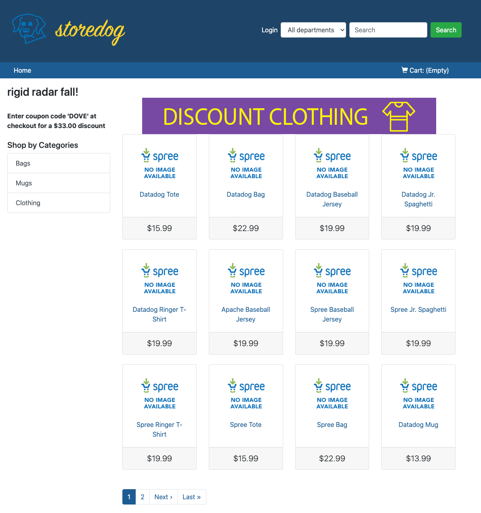

# Ecommerce App on AKS in Azure

Steps to help you get started with a Datadog and Ecommerce (Storedog) app install on Azure Kubernetes Service (AKS). We'll use Azure Cloud Shell for these steps as it has `az cli`, `kubectl` and `helm` ready to go!

## Azure Integration Steps
Note that these won't be required if using the new sign-up flow for Azure Marketplace in the future, but for now we'll go through the old process.
Further, the Subscription to which you deploy the read-only Service Principal to should also be the one that contains your AKS cluster, as we'll be using that data later on!

### Get Tenant ID
This command will help you get your tenant ID, though the creation step should as well. 

```bash
az account show --output json | jq -r .tenantId
```

### Set Up Service Principal
In order to set up a service principal, as per [the Datadog docs for the Azure integration](https://docs.datadoghq.com/integrations/azure/?tab=azurecliv20#integrating-through-the-azure-cli), you'll first need to select the subscription you want:

```bash
az account list --output table
```

This outputs your subscriptions as a table, so that you can copy the subscription ID that you need for the next step. Again, make sure this is the subscription your AKS cluster lives in! 

> Note: If you've only got one subscription and tenant, or if the defaults for both are ok, there's a full example at the end. 

Then add a read-only service principal to that subscription, making sure to note the credentials for use with Datadog

```bash
SUBSCRIPTION_ID=$(az account show --output json | jq -r .id)
echo $SUBSCRIPTION_ID
az ad sp create-for-rbac --role "Monitoring Reader" --scopes /subscriptions/$SUBSCRIPTION_ID
```

#### Full Example
Use this only if you've got one tenant, one subscription, or if the defaults are OK!

```bash
az ad sp create-for-rbac \
 --role "Monitoring Reader" \
 --scopes /subscriptions/$(az account list --output json | jq -r .[0].id)
```

This outputs your AppID (Client ID), password (Client Secret) and tenant - you'll need all three over in Datadog, so put them somewhere temporarily in case the Azure Shell session expires. 

### Add Service Principal to Datadog

In Datadog, navigate to the [Azure Integration page](https://app.datadoghq.com/account/settings#integrations/azure), and click the configuration tab, as shown in the following image:



Enter the Tenant, AppID (Client ID) and Password (Client Secret) you got as output from the previous steps in Azure Cloud Shell.  Once entered, click _Install Integration_.

You've now set up Datadog to get Azure data flowing into Datadog for that subscription! If you have more than one, feel free to do this for the rest, but for the purpose of our session, we'll be using the one that contains the AKS cluster that already exists. 

## For Azure Cloud Shell

### Helm

[Helm chart link - dtdg.co/ddhelm](http://dtdg.co/ddhelm)

Clone this repository, then `cd` to that folder:

```bash
git clone https://github.com/DataDog/ecommerce-workshop.git
cd ecommerce-workshop/deploy/azure/aks
```

Add the Helm repositories:
```bash
helm repo add datadog https://helm.datadoghq.com
helm repo add stable https://kubernetes-charts.storage.googleapis.com/
helm repo update
```

#### Get Datadog API and APP Keys

##### 1. Export the _API_ key

Get the API from https://app.datadoghq.com/account/settings#api and paste it after the `=` sign in the following example:
```bash
export DD_API_KEY=KEY_FROM_DATADOG
```

##### 2. Export the _APP_ key

Get the API from https://app.datadoghq.com/account/settings#api scroll to the section after API for the APP keys.  Enter "Azure" in the "New application key" field and click "Create Application Key".  Hover over the new key and paste it after the `=` sign in the following example:

```bash
export DD_APP_KEY=KEY_FROM_DATADOG
```

##### 3. Install the Agent
Now that we have both exported in our shell, we can proceded to the agent install:

```bash
helm install datadogagent \
 --set datadog.apiKey=$DD_API_KEY \
 --set datadog.appKey=$DD_APP_KEY \
 -f values.yaml datadog/datadog
 ```
 
Things should now be appearing in Datadog, but we'll also want to ensure that we get the Kubernetes metrics as well. To do so, open the values.yaml file we used previously, and around line 276, remove the `[]` after the `env` line, and add the following the following text:
```yaml
  env:
    - name: "DD_KUBELET_TLS_VERIFY"
      value: "false"
```

Then we'll re-apply our helm chart in order to update it: 
```bash
helm upgrade datadogagent \
 --set datadog.apiKey=$DD_API_KEY \
 --set datadog.appKey=$DD_APP_KEY \
 -f values.yaml datadog/datadog
```

We should now see the some of the infrastructure start to come online in Datadog. Note that it may take a couple of minutes, but will eventually look like the following: 



### Cluster Agent
We'll now deploy the cluster agent - in the values.yaml file, the block around line 390 contains the cluster agent config. Change the `false` on line 397 to `true`, then save and upgrade the cluster once more. (Last time, I promise!) Hint: you can use `code values.yaml` to open it in the embedded VS Code editor, just remember to hit cmd+s (on macOS) or ctrl+s (Linux/Windows) to save the file before continuing. 

It should look like this when you're done:

```yaml
clusterAgent:
  ## @param enabled - boolean - required
  ## Set this to true to enable Datadog Cluster Agent
  #
  enabled: true
```

Once it's saved, we'll run the familiar upgrade command via helm, though note we'll replace this with the `values_full.yaml` version which enables a few more parameters:

```bash
helm upgrade datadogagent \
 --set datadog.apiKey=$DD_API_KEY \
 --set datadog.appKey=$DD_APP_KEY \
 -f values.yaml datadog/datadog
```

## Exploring Kubernetes in Datadog

Note that though we now have data in Datadog, we also need to configure the integration. This can be done via the integrations page, specifically in the Kubernetes integration tab: https://app.datadoghq.com/account/settings#integrations/kubernetes

In the "configuration" tab, click "Install Integration" (as pictured below) - we've done the heavy lifting already. 


Once we have the Kubernetes Integration installed, we can then explore the [Kubernetes default dashboards](https://app.datadoghq.com/screen/integration/86/kubernetes-overview) in Datadog.



## Deploy Storedog
We've created a sample app to allow us to look at other Datadog services. 

The manifests for this application can be found in the [storedog](deploy/azure/aks/storedog/) subfolder. 

In order to launch all of the microservices at once, the following command will apply all of the yaml manifests in that folder:

```bash
kubectl apply -f storedog/.
```

### Check Containers in Datadog
The containers we've just launched should now also be viewable in [Datadog's container view](https://app.datadoghq.com/containers). 

### Grab the URL for Storedog
Back in the Azure portal, you can now get the IP address for our storedog frontend. Note that it's just an IP for now as we're testing, but we can add a DNS record for these when required. 



### Check out Storedog
Storedog, our microservices app, launched in AKS, is now reachable via the IP we grabbed above.  




### Deploy Full Values YAML

Now that we've gone over the `values.yaml` changes you'd want to make, you can deploy the "full" set of options in the `values_full.yaml` file, which enables logging and tracing as well:

```bash
helm upgrade datadogagent \
 --set datadog.apiKey=$DD_API_KEY \
 --set datadog.appKey=$DD_APP_KEY \
 -f values_full.yaml datadog/datadog
```