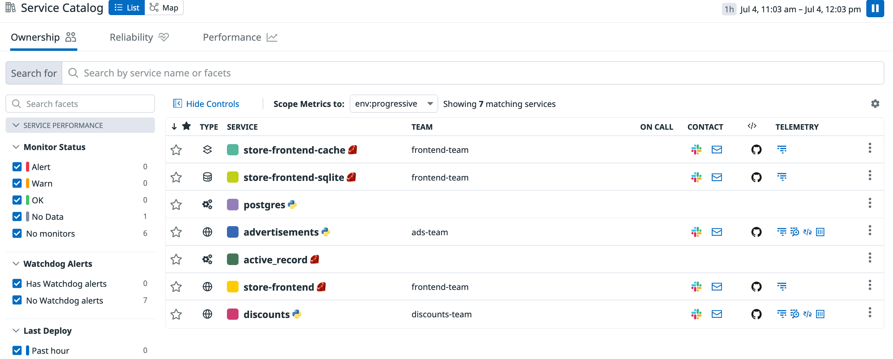

# Service Catalog Definitions

You can use the YAML files on this folder as a base to add service definitions for your services, for them to appear in the new [Service Catalog page](https://docs.datadoghq.com/tracing/faq/service_catalog/).

To send the service definitions to your Datadog org, edit the YAML files to include the correct links (for example, links to the right notebooks in your org for runbooks) and use the API to POST those definitions:

```
curl -vvvv --request POST 'https://api.datadoghq.com/api/unstable/services/definition' \
--header 'DD-API-KEY: <your_api_key>' \
--header 'DD-APPLICATION-KEY: <your_app_key>' \
--header 'Content-Type: application/json' \
--data-binary '@<file.yaml>'
```

After sending the definitions, this is how your Service Catalog page should look like:


